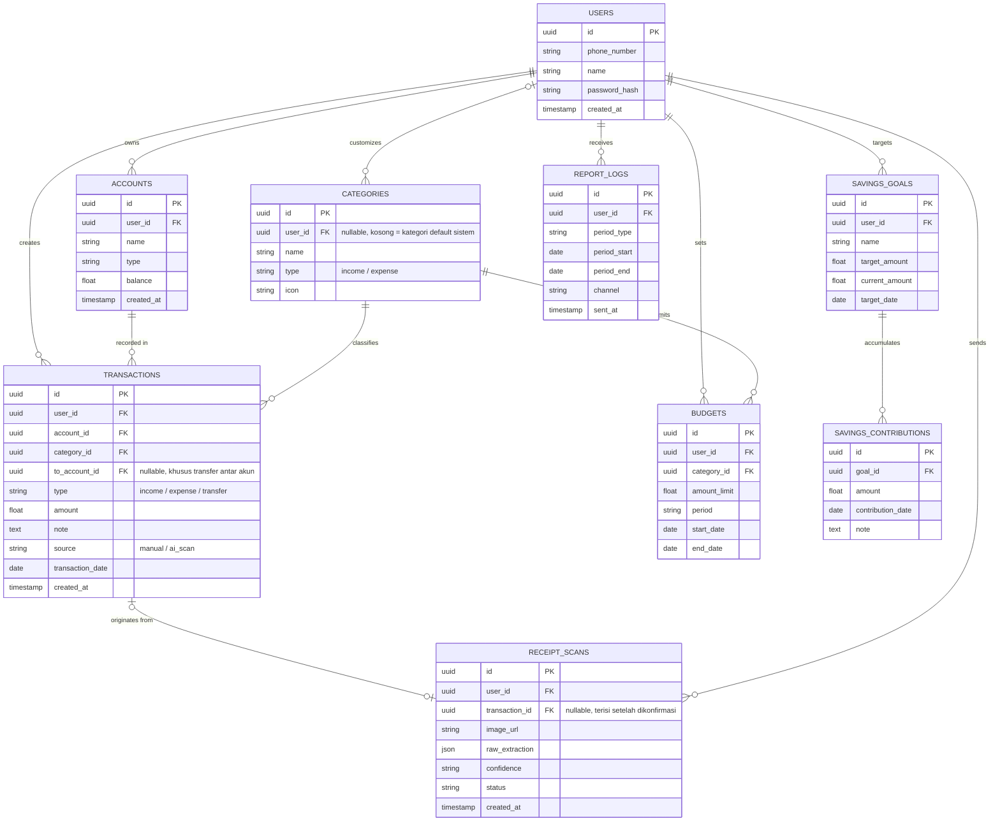

# PRD: SmartVault

Aplikasi manajemen keuangan pribadi lintas platform (Android & iOS) dengan AI receipt scanner via WhatsApp dan laporan insight otomatis terjadwal.

**Status:** Draft v1 — Portofolio Proyek
**Terakhir diupdate:** September 2026

---

## Problem Statement

Kebanyakan orang tidak punya satu tempat yang konsisten untuk melihat kondisi keuangannya. Pencatatan pengeluaran sering berhenti di tengah jalan karena repot buka aplikasi dan mengetik manual setiap transaksi, sehingga saldo di aplikasi jadi tidak akurat dan akhirnya ditinggalkan. Orang juga jarang sadar berapa rata-rata pengeluarannya per kategori per minggu/bulan sampai sudah kebablasan, karena tidak ada notifikasi otomatis saat mendekati batas budget. Selain itu, kebanyakan aplikasi finance mengharuskan user membuka aplikasi terpisah untuk melihat laporan, padahal channel yang paling sering dibuka sehari-hari adalah WhatsApp.

SmartVault menjawab ini dengan mengizinkan pencatatan transaksi cukup lewat foto struk yang dikirim ke bot WhatsApp (tanpa ketik manual), serta mengirim laporan insight langsung ke WhatsApp secara terjadwal — bukan menunggu user membuka aplikasi.

## Goals

- User dapat mencatat transaksi manual di app dalam < 15 detik, atau otomatis lewat foto struk ke bot WhatsApp tanpa mengetik nominal sama sekali.
- Akurasi ekstraksi AI vision terhadap struk yang jelas/tidak buram mencapai ≥ 90% benar tanpa perlu koreksi manual dari user.
- Laporan insight (mingguan & bulanan) terkirim ke WhatsApp 100% tepat jadwal tanpa terlewat atau ganda.
- User menerima notifikasi budget dalam < 1 menit setelah transaksi yang menyebabkan progress menyentuh ambang 80%/100%.
- Biaya operasional aplikasi tetap di bawah Rp100.000/bulan pada skala portofolio (puluhan–seratusan transaksi/struk per bulan).
- 70% dari total transaksi tercatat berasal dari scan struk otomatis (bukan input manual), sebagai indikator fitur AI vision benar-benar dipakai dan mengurangi friksi pencatatan.

## Target Users

- **End user:** individu yang ingin mengelola keuangan pribadi (pemasukan, pengeluaran, tabungan) tanpa harus disiplin mengetik setiap transaksi secara manual.
- **Admin/stakeholder:** pemilik produk (developer sendiri, untuk konteks portofolio) yang memantau biaya API AI vision, kualitas ekstraksi, dan penggunaan free tier infrastruktur.
- **AI/dev:** AI coding agent dan developer yang membangun serta memelihara fitur berdasarkan dokumen ini sebagai acuan bersama.

## User Stories

- Sebagai pengguna baru, aku mau mendaftar akun pakai nomor HP supaya tidak perlu membuat/mengingat username terpisah.
  Acceptance: OTP 6 digit dikirim via WhatsApp dalam < 10 detik, kedaluwarsa dalam 5 menit, akun langsung aktif setelah OTP benar.

- Sebagai pengguna, aku mau login sehari-hari cukup pakai nomor HP + password/PIN supaya tidak perlu menunggu OTP tiap kali buka app.
  Acceptance: login berhasil dalam < 2 detik jika kredensial benar; percobaan gagal dibatasi maksimal 5x per 15 menit per nomor.

- Sebagai pengguna yang lupa password, aku mau reset password lewat OTP WhatsApp supaya tetap bisa masuk tanpa kontak admin manual.
  Acceptance: OTP reset terpisah dari OTP registrasi; setelah berhasil, sesi lama otomatis logout dari semua device.

- Sebagai pengguna, aku mau menambahkan beberapa akun/dompet (cash, bank, e-wallet, kartu kredit) supaya saldo tiap sumber uang tidak tercampur.
  Acceptance: saldo tiap akun ditampilkan terpisah, ada total net worth gabungan, dan bisa transfer antar akun tanpa dobel-catat sebagai income/expense.

- Sebagai pengguna, aku mau mencatat transaksi manual dari app supaya bisa langsung isi transaksi yang tidak ada struknya (mis. bayar tunai ke teman).
  Acceptance: form berisi jenis (pemasukan/pengeluaran), kategori, nominal, tanggal, akun sumber, catatan; tersimpan < 1 detik.

- Sebagai pengguna, aku mau kirim foto struk atau screenshot m-banking/e-wallet ke bot WhatsApp supaya tidak perlu mengetik nominal transaksi secara manual.
  Acceptance: bot membalas hasil bacaan (merchant, nominal, tanggal, kategori, jenis transaksi) dalam < 15 detik untuk dikonfirmasi.

- Sebagai pengguna, aku mau mengonfirmasi atau mengoreksi hasil bacaan struk sebelum tersimpan — termasuk memastikan jenis transaksinya pemasukan atau pengeluaran — supaya data finansialku tidak salah gara-gara AI salah baca atau salah tebak arah transfer.
  Acceptance: transaksi hasil scan tidak pernah tersimpan otomatis tanpa balasan konfirmasi eksplisit dari user (misal "ya" atau koreksi).

- Sebagai pengguna, aku mau melihat riwayat transaksi dan bisa memfilter/mencari supaya gampang menelusuri transaksi lama.
  Acceptance: filter tersedia untuk akun, kategori, jenis transaksi, dan rentang tanggal; ada kolom pencarian teks pada catatan.

- Sebagai pengguna, aku mau menetapkan limit budget per kategori per bulan supaya sadar sebelum pengeluaran kebablasan.
  Acceptance: notifikasi push terkirim otomatis saat progress kategori menyentuh 80% dan 100% dari limit.

- Sebagai pengguna, aku mau membuat target tabungan dengan nominal dan tenggat tertentu supaya termotivasi menabung terarah.
  Acceptance: progress bar terupdate tiap ada kontribusi manual; sistem menampilkan proyeksi tanggal tercapai berdasarkan rata-rata kontribusi historis.

- Sebagai pengguna, aku mau melihat diagram rata-rata pemasukan dan pengeluaran mingguan/bulanan supaya paham polanya tanpa harus hitung manual.
  Acceptance: diagram pie (komposisi kategori) dan bar (tren per periode) tersedia baik di dashboard app maupun di laporan WhatsApp.

- Sebagai pengguna, aku mau menerima laporan insight otomatis di WhatsApp tiap minggu dan bulan supaya tidak perlu buka app hanya untuk cek ringkasan keuangan.
  Acceptance: laporan terkirim tepat jadwal (akhir minggu/akhir bulan), berisi ringkasan teks + gambar chart, tidak pernah terkirim dobel untuk periode yang sama.

## Functional Requirements

**Autentikasi**
- [ ] Registrasi akun dengan nomor HP, verifikasi OTP via WhatsApp
- [ ] Login harian dengan nomor HP + password/PIN (tanpa OTP)
- [ ] Reset password via OTP WhatsApp (key terpisah dari OTP registrasi)
- [ ] Rate limiting percobaan login gagal dan permintaan OTP

**Multi-Akun / Dompet**
- [ ] CRUD akun/dompet (cash, bank, e-wallet, kartu kredit)
- [ ] Transfer antar akun tanpa dobel-hitung sebagai income/expense
- [ ] Dashboard net worth (total aset dikurangi hutang kartu kredit)

**Transaksi & Kategori**
- [ ] CRUD transaksi manual (pemasukan & pengeluaran)
- [ ] Kategori default sistem + kategori custom milik user, terpisah tipe income/expense
- [ ] Riwayat transaksi dengan filter (akun, kategori, jenis, tanggal) dan pencarian teks

**AI Vision — Scan Struk via WhatsApp**
- [ ] Terima gambar dari webhook WhatsApp, teruskan ke Claude API (vision)
- [ ] Ekstraksi terstruktur: merchant, nominal, tanggal, kategori, confidence level
- [ ] Deteksi duplikasi (hash gambar + nominal + tanggal berdekatan)
- [ ] Konfirmasi wajib ke user sebelum data tersimpan, termasuk konfirmasi jenis transaksi (pemasukan/pengeluaran) khusus untuk kasus ambigu seperti transfer
- [ ] Audit trail hasil ekstraksi (tabel RECEIPT_SCANS) untuk evaluasi akurasi
- [ ] Retensi gambar struk terbatas (auto-hapus setelah periode tertentu)

**Budget**
- [ ] Set limit pengeluaran per kategori per periode (mingguan/bulanan)
- [ ] Perhitungan progress otomatis tiap ada transaksi baru
- [ ] Notifikasi push saat progress mencapai 80% dan 100%

**Savings Goal**
- [ ] CRUD target tabungan (nama, nominal target, tenggat opsional)
- [ ] Kontribusi manual ke goal, progress bar otomatis terupdate
- [ ] Proyeksi tanggal pencapaian berdasarkan rata-rata kontribusi historis

**Insight & Diagram**
- [ ] Kalkulasi rata-rata & total pemasukan/pengeluaran mingguan/bulanan per kategori
- [ ] Diagram pie (komposisi kategori) dan bar (tren periode) di dashboard app
- [ ] Diagram sama digenerate sebagai gambar untuk laporan WhatsApp

**Bot WhatsApp — Laporan Otomatis**
- [ ] Scheduler (Redis RQ/rq-scheduler) memicu job akhir minggu & akhir bulan per user
- [ ] Generate ringkasan teks + chart, kirim via WhatsApp API
- [ ] Log riwayat pengiriman laporan (cegah dobel/terlewat)

**Profile**
- [ ] Lihat & edit data profil (nama, nomor HP, preferensi notifikasi/jadwal laporan)

*(v1 — ditunda dari MVP)*
- [ ] Autentikasi dua faktor (2FA) opsional
- [ ] Export data ke CSV/PDF
- [ ] Mode privasi (blur nominal saat screenshot)

## Non-Functional Requirements

- **Performa:** buka dashboard app < 2 detik; simpan transaksi manual < 1 detik (P95); balasan bot WhatsApp untuk hasil scan struk < 15 detik.
- **Security:** password/PIN di-hash (bcrypt/argon2); OTP disimpan di Redis dengan TTL dan tidak pernah di-log dalam bentuk plain text; foreign key pakai uuid (bukan integer auto-increment) agar tidak mudah dienumerasi; gambar struk tidak disimpan permanen tanpa kebutuhan.
- **Reliability:** scheduler laporan WhatsApp tidak boleh mengirim laporan ganda atau terlewat untuk periode yang sama (dicek lewat REPORT_LOGS); job retensi gambar struk berjalan konsisten sesuai jadwal.
- **Usability:** user baru bisa menyelesaikan pencatatan transaksi pertama (baik manual maupun scan struk) dalam < 1 menit tanpa tutorial.
- **Biaya:** seluruh komponen infrastruktur mengutamakan free tier; total biaya operasional bulanan pada skala portofolio tetap di bawah Rp100.000, dengan biaya AI vision & WhatsApp gateway bersifat pay-as-you-go proporsional terhadap pemakaian riil (lihat bagian 19 Laporan Teknis).
- **Portabilitas:** logic bisnis sepenuhnya berada di backend (NestJS) yang diakses lewat REST API biasa, sehingga lapisan mobile frontend (React Native) dapat diganti tanpa mengubah backend, database, atau bot WhatsApp. Backend dan frontend memakai bahasa yang sama (TypeScript), memudahkan sharing tipe data dan skema validasi antar layer.

## Scope

**In scope (MVP):**
- Registrasi, login, reset password (autentikasi berbasis nomor HP)
- Multi-akun/dompet manual (tanpa integrasi bank/e-wallet nyata)
- Pencatatan transaksi manual + riwayat dengan filter
- Scan struk otomatis via bot WhatsApp (AI vision) dengan lapisan konfirmasi wajib
- Budget per kategori + notifikasi
- Target tabungan (savings goal) virtual/earmark
- Insight & diagram pemasukan/pengeluaran (pie & bar, di app dan WhatsApp)
- Bot WhatsApp untuk laporan insight terjadwal (mingguan & bulanan)

**Out of scope (ditunda):**
- Integrasi langsung ke API bank/e-wallet resmi (Brick/Finantier) — saldo tetap self-reported di MVP
- Autentikasi dua faktor (2FA)
- Export data ke CSV/PDF
- Mode privasi (blur nominal di screenshot)
- Kolaborasi/shared budget antar user (mis. untuk pasangan/keluarga)
- Migrasi ke WhatsApp Business API resmi (Meta) — MVP masih boleh pakai gateway tidak resmi (Fonnte/Wablas) untuk menekan biaya pengembangan
- Migrasi frontend ke framework lain — tidak direncanakan; React Native + TypeScript sudah jadi pilihan final selaras dengan backend NestJS

Catatan: PRD ini adalah living document. Update bagian Scope setiap ada keputusan fitur baru yang masuk atau ditunda.

---

## Tech Stack

Bagian tambahan (di luar 7 bagian wajib) — ringkasan implementasi teknis agar AI coding agent langsung tahu tools apa yang dipakai di tiap layer, tanpa perlu buka dokumen terpisah. Detail alasan pemilihan tiap teknologi ada di dokumen *Laporan Teknis SmartVault*.

| Layer | Teknologi |
|---|---|
| Mobile app | React Native (TypeScript) — satu codebase Android & iOS |
| Styling | NativeWind (Tailwind CSS untuk React Native) |
| State management | Zustand |
| Chart di app | Victory Native |
| Backend | Node.js — NestJS (TypeScript) |
| Validasi request | Zod |
| ORM & migrasi | Prisma |
| Database utama | PostgreSQL (Supabase/Neon, free tier) |
| Cache, scheduler & OTP | Redis (Upstash/self-host Docker, free tier) |
| Task scheduler | BullMQ |
| Object storage | Supabase Storage / Cloudinary (free tier) |
| AI Vision (scan struk) | Claude API — model Haiku |
| Chart untuk laporan WA | chartjs-node-canvas |
| WhatsApp Bot | Meta Cloud API / Fonnte-Wablas |
| Push notification | Firebase Cloud Messaging |
| Autentikasi | Password/PIN (hash bcrypt/argon2) + OTP WhatsApp via Redis |
| Hosting backend | Railway / Render (free tier awal) |
| CI/CD | GitHub Actions |

**Prinsip desain teknis:** seluruh stack dipilih dengan bias kuat ke gratis/open source dan free tier di setiap layer, karena proyek ini dikerjakan solo untuk kebutuhan portofolio. Frontend dan backend sengaja memakai satu bahasa yang sama (TypeScript) agar tipe data dan skema validasi (Zod) bisa dipakai ulang di kedua sisi. Backend sepenuhnya terpisah dari frontend lewat REST API biasa — dipanggil oleh React Native app maupun bot WhatsApp — sehingga tidak ada logic bisnis yang terduplikasi.

---

## Skema Database (ERD)

Bagian tambahan — rancangan tabel database beserta relasinya, dalam notasi Mermaid ER Diagram (ikut ter-render otomatis sebagai diagram visual di GitHub, VS Code, atau Claude). Tipe data dan kolom PK/FK ditulis eksplisit di tiap entitas, mengikuti notasi crow's foot untuk kardinalitas relasi.

**Catatan entitas:**
- **USERS** adalah entitas pusat — hampir semua tabel lain menyimpan `user_id` karena seluruh data bersifat multi-tenant per pengguna.
- **CATEGORIES.user_id** bersifat nullable: baris dengan `user_id` kosong adalah kategori default sistem yang dipakai semua user; yang terisi adalah kategori custom milik user tertentu.
- **TRANSACTIONS** adalah tabel inti tempat bertemunya hampir seluruh fitur — kolom `source` membedakan transaksi manual dari hasil scan struk AI, kolom `type` membedakan pemasukan/pengeluaran/transfer.
- **RECEIPT_SCANS** adalah audit trail hasil ekstraksi AI vision (bagian 5 Laporan Teknis) — dipakai untuk evaluasi akurasi model, relasinya ke TRANSACTIONS bersifat opsional (terisi hanya setelah user mengonfirmasi hasil bacaan).
- **REPORT_LOGS** mencatat riwayat pengiriman laporan WhatsApp agar scheduler tidak mengirim laporan ganda atau terlewat untuk periode yang sama.
- Seluruh primary/foreign key memakai tipe **uuid** (bukan integer auto-increment) agar id tidak mudah ditebak/dienumerasi dari sisi client — praktik umum untuk data finansial yang sensitif.

---

## Alur (Flow)

### 1. Alur Registrasi & Login
1. User buka app, pilih "Daftar", isi nomor HP + nama + password/PIN.
2. Backend cek nomor belum terdaftar.
3. OTP 6 digit dibuat, disimpan di Redis (TTL 5 menit), dikirim via WhatsApp.
4. User masukkan OTP di app → backend cocokkan dengan Redis.
5. Jika valid: hapus key OTP, hash password, buat record User baru, terbitkan token JWT, user langsung masuk ke dashboard.
6. Untuk login berikutnya: user cukup masukkan nomor HP + password/PIN → backend cocokkan hash → terbitkan JWT baru.

### 2. Alur Reset Password
1. User tap "Lupa Password" di halaman login, masukkan nomor HP.
2. Backend generate OTP baru (key Redis terpisah dari OTP registrasi), kirim via WhatsApp.
3. User masukkan OTP → backend verifikasi.
4. Jika valid: user diminta set password baru → password di-hash & disimpan → seluruh sesi/token lama di-invalidate demi keamanan.

### 3. Alur Pencatatan Transaksi Manual
1. User tap tombol tambah transaksi di dashboard.
2. Pilih jenis (pemasukan/pengeluaran), kategori, akun sumber, nominal, tanggal, catatan opsional.
3. Tap simpan → backend validasi → transaksi tersimpan, saldo akun terkait terupdate.
4. Jika transaksi menyebabkan progress budget kategori menyentuh ambang (80%/100%), notifikasi push terkirim.

### 4. Alur Scan Struk Otomatis (AI Vision)
1. User kirim foto struk atau screenshot m-banking/e-wallet ke bot WhatsApp.
2. Webhook WhatsApp meneruskan URL gambar ke backend.
3. Backend unduh gambar, kirim ke Claude API (vision) dengan prompt ekstraksi terstruktur.
4. Model mengembalikan JSON: merchant, nominal, tanggal, kategori, confidence level.
5. Backend cek deduplikasi (hash gambar + nominal + tanggal berdekatan) — jika mirip transaksi yang sudah ada, tandai sebagai kemungkinan duplikat.
6. Bot membalas ke user: hasil bacaan lengkap + jenis transaksi (pemasukan/pengeluaran) yang perlu dikonfirmasi — terutama untuk bukti transfer yang arah dananya ambigu dari gambar saja.
7. User membalas "ya" untuk konfirmasi, atau mengirim koreksi (nominal/kategori/jenis transaksi yang salah).
8. Setelah dikonfirmasi: backend simpan sebagai Transaction baru, update saldo Account, simpan juga raw extraction ke tabel RECEIPT_SCANS sebagai audit trail.

### 5. Alur Budget & Notifikasi
1. User set limit budget per kategori per periode (mis. "Makan: Rp1.000.000/bulan") dari halaman Budget.
2. Setiap kali ada transaksi baru pada kategori tersebut, backend hitung ulang total pengeluaran periode berjalan.
3. Jika progress menyentuh 80% → notifikasi push "mendekati limit". Jika 100% atau lebih → notifikasi push "limit terlampaui".
4. User tetap bisa mencatat transaksi meski sudah over budget (notifikasi bersifat peringatan, bukan blokir).

### 6. Alur Target Tabungan (Savings Goal)
1. User buat goal baru: nama, nominal target, tenggat opsional.
2. User menambah kontribusi manual kapan saja lewat tombol "tambah dana".
3. Sistem update current_amount, hitung ulang progress dan proyeksi tanggal tercapai berdasarkan rata-rata kontribusi historis.
4. User dapat memantau progress lewat card goal di dashboard.

### 7. Alur Laporan WhatsApp Terjadwal
1. Job scheduler (Redis RQ/rq-scheduler) berjalan otomatis setiap akhir minggu dan akhir bulan, per user.
2. Backend hitung insight periode tersebut: total & rata-rata pemasukan/pengeluaran, kategori terboros, progress savings goal.
3. chartjs-node-canvas generate gambar pie chart (komposisi kategori) dan bar chart (tren periode).
4. Backend kirim teks ringkasan + gambar chart via WhatsApp API ke nomor user.
5. Backend catat pengiriman ke tabel REPORT_LOGS untuk mencegah laporan dikirim ganda atau terlewat pada periode yang sama.

### 8. Alur Multi-Akun & Transfer
1. User tambah akun baru (cash/bank/e-wallet/kartu kredit) dengan saldo awal.
2. Transaksi harian dipilih dari salah satu akun sebagai sumber dana.
3. Untuk pindah dana antar akun sendiri (mis. top-up e-wallet dari rekening bank), user pilih jenis "transfer" — dicatat dengan account_id (sumber) dan to_account_id (tujuan), tidak dihitung sebagai income/expense baru agar net worth total tidak berubah.
4. Dashboard menampilkan saldo per akun dan total net worth gabungan (aset dikurangi hutang kartu kredit).

---

*Dokumen ini disusun mengikuti template 7 bagian wajib PRD.md, dengan tambahan bagian Alur (Flow) untuk memberi AI coding agent konteks langkah-demi-langkah tiap fitur sebelum mulai vibe coding.*
